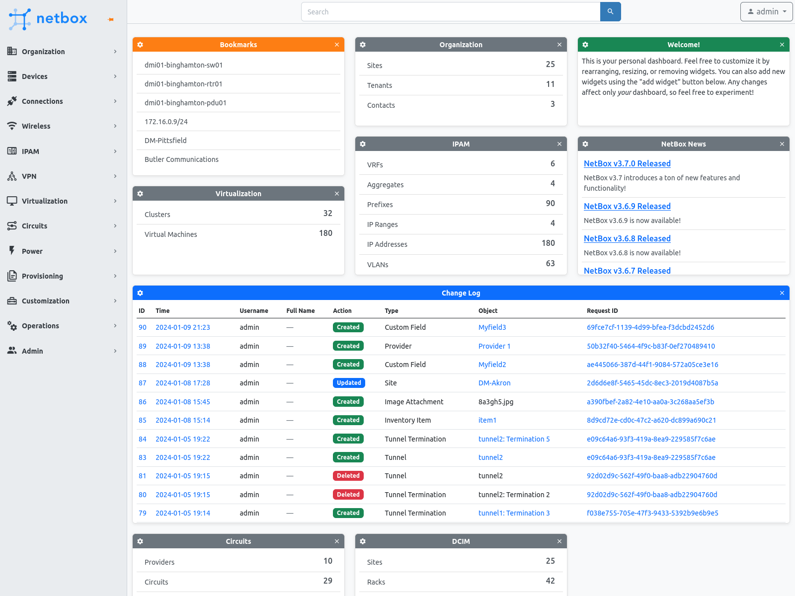
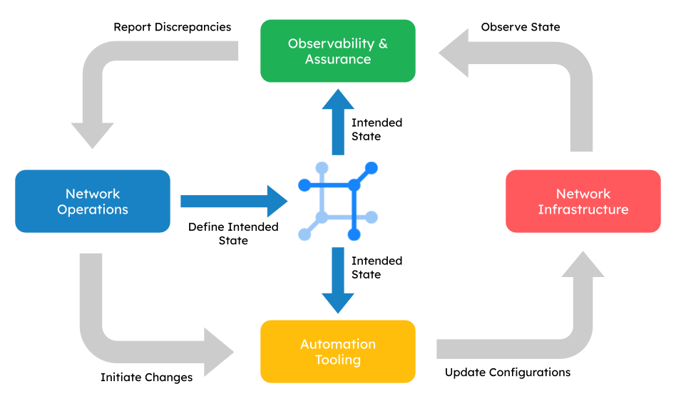
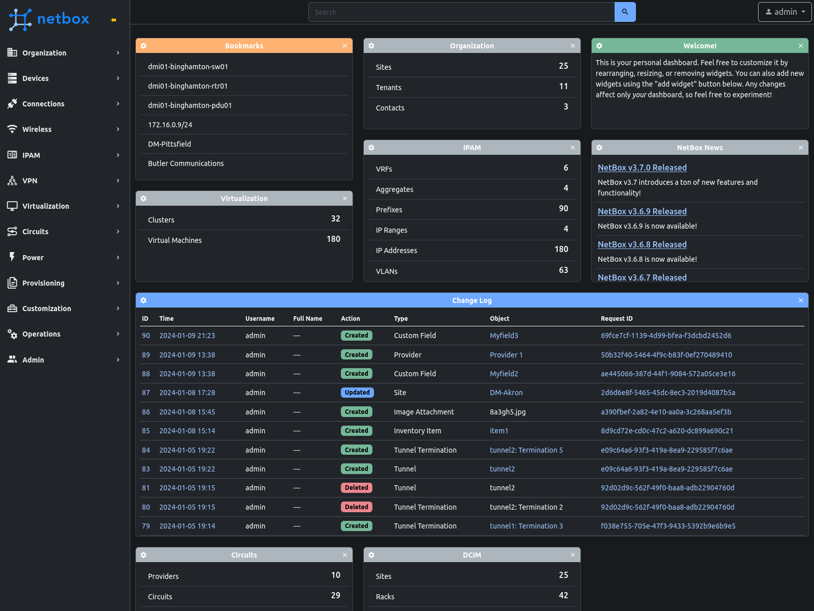
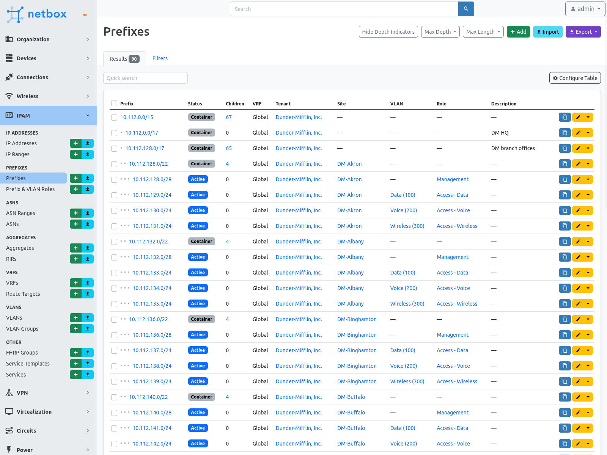
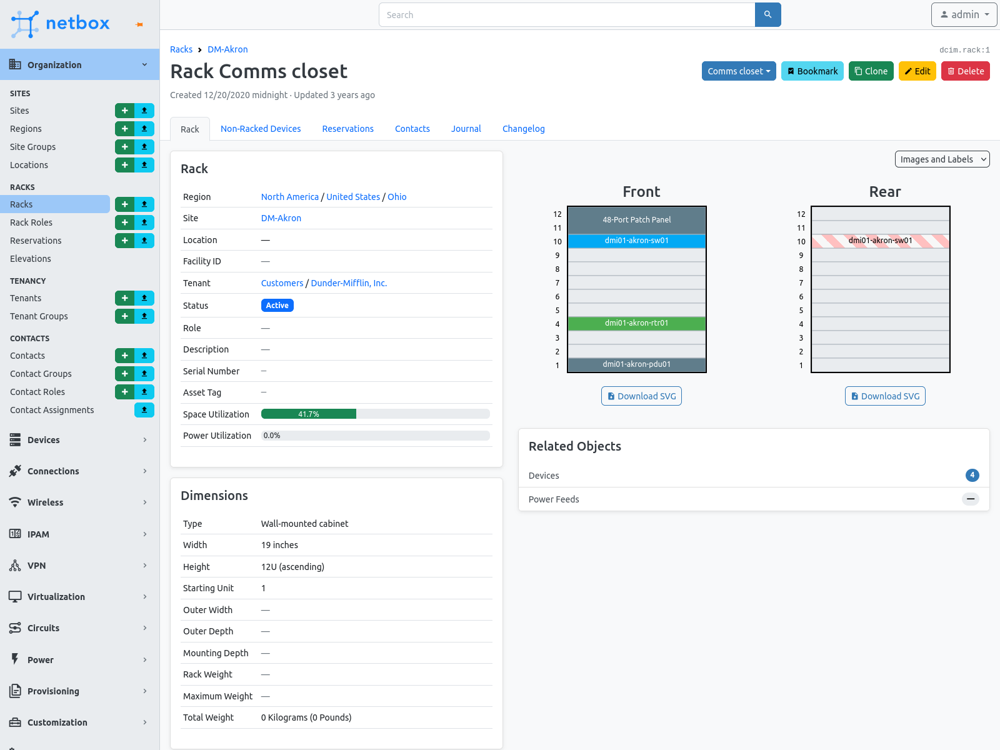
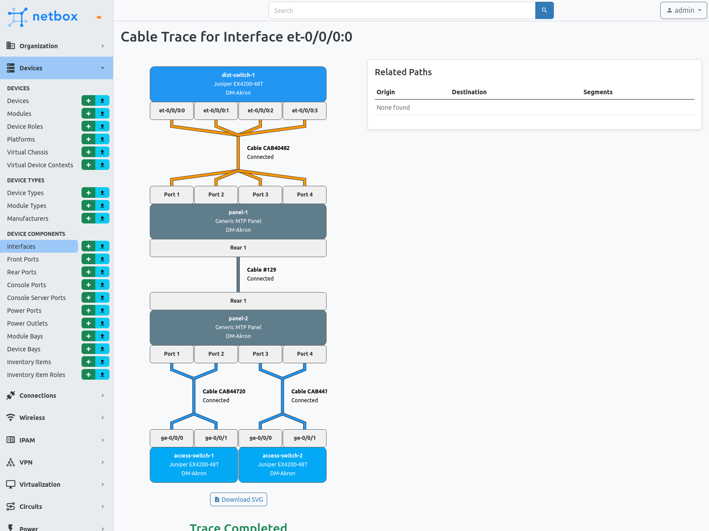

  
  
<strong>每个自动化网络的基石</strong>

  
  
  
  
  
  
  

NetBox 的存在是为了赋予网络工程师更大的权力。自2016年发布以来，它已成为数千家全球组织中对建模和记录网络基础设施的首选解决方案。作为传统IPAM和DCIM应用程序的继任者，NetBox为所有与网络相关的事物提供了一个统一、广泛且易于访问的数据模型。通过提供一个强大的用户界面和可编程API，涵盖了从电缆映射到设备配置的所有内容，NetBox作为现代网络的中心真理源。

  <a href="#netboxs-role">NetBox 的角色</a> |
  <a href="#why-netbox">为什么选择 NetBox？</a> |
  <a href="#getting-started">入门指南</a> |
  <a href="#get-involved">参与其中</a> |
  <a href="#project-stats">项目统计</a> |
  <a href="#screenshots">截图</a>

  

## NetBox 的角色

NetBox 作为您的网络基础设施的**真实来源**。它的任务是定义和验证所有网络组件和资源的_预期状态_。NetBox 不直接与网络节点交互；相反，它通过编程方式将这些数据提供给专用的自动化、监控和保障工具。这种责任的分离使得构建一个稳健但灵活的自动化系统成为可能。

  

上图说明了自动化网络的推荐部署架构，利用 NetBox 作为网络状态的中心权威。这种方法允许您的团队更换个别工具以满足不断变化的需求，同时保留了一个可预测的模块化工作流程。

## 为什么选择 NetBox？

### 全面的数据模型

机架、设备、电缆、IP地址、VLAN、电路、电源、VPN等等：NetBox 专为网络而建。其全面且彼此紧密关联的数据模型提供了对众多网络原语进行自然和高度结构化建模的可能性，这是通用工具无法实现的。而且，无需浪费时间来考虑如何构建数据库：一切在安装时都已准备就绪。

### 专注于开发

NetBox 致力于实现一个单一的目标：为使网络基础设施以编程方式访问提供最佳解决方案。与试图在一体化工具中笨拙地添加半成品功能以尝试满足所有需求的“一刀切”工具不同，NetBox 致力于其核心功能。NetBox 提供了最佳的解决方案，用于建模网络基础设施，并提供了丰富的API，用于与在网络自动化的其他领域表现出色的工具集成。

### 可扩展和可定制

没有两个网络是完全相同的。用户可以通过自定义字段和标签来扩展 NetBox 的本机数据模型，以最适应其独特的需求。您甚至可以编写自己的插件，引入全新的对象和功能！

### 灵活的权限

NetBox 包含一个完全可定制的权限系统，允许管理员在为用户和组分配角色时拥有令人难以置信的细粒度。想要限制某些用户仅能使用电缆而不能更改IP地址吗？或者每个团队应仅访问特定租户？NetBox 允许您自行制定角色。

### 自定义验证和保护规则

您输入 NetBox 的数据对于网络操作至关重要。除了其强大的本机验证规则外，NetBox 还为管理员提供了定义对象的自定义验证规则的机制。自定义验证既可用于确保新对象或修改后的对象

符合一组规则，也可用于防止删除不符合某些条件的对象（例如，您可能希望防止删除具有“活动”状态的设备）。

### 设备配置渲染

NetBox 可以渲染用户创建的 Jinja2 模板，以从其自身数据生成设备配置。配置模板可以单独上传，也可以从外部源（如 git 存储库）自动拉取。渲染后的配置可以通过 REST API 检索，以供直接应用于通过诸如 Ansible 或 Salt 等配置管理工具进行网络设备的配置。

### 自定义脚本

复杂的工作流程，例如为新分支办事处进行配置，可能在用户界面上执行起来很繁琐。NetBox 允许您编写并上传自定义脚本，可以直接从用户界面运行。脚本会提示用户输入，然后自动执行必要的任务，大大简化了本来繁琐的流程。

### 自动化事件

用户可以定义事件规则，以在 NetBox 事件发生时自动触发自定义脚本或出站 Webhook。例如，您可能希望在将新设备添加到 NetBox 时自动更新网络监控服务，或在分配IP范围时更新DHCP服务器。

### 全面的更改日志

NetBox 自动记录所有受管对象的创建、修改和删除，提供了详尽的更改历史记录。更改可以归因于执行操作的用户，并且相关更改会根据请求ID自动分组。

> [!注意]
> 可以在 [简介文档](https://docs.netbox.dev/en/stable/introduction/) 中找到 NetBox 的各种功能的完整列表。

## 入门指南

* 只想探索吗？立即查看[我们的公共演示](https://demo.netbox.dev/)！
* [官方文档](https://docs.netbox.dev)提供了全面的介绍。
* 查看[我们的维基](https://github.com/netbox-community/netbox/wiki/Community-Contributions)，以了解更多项目，以充分利用 NetBox！

   
  寻找企业解决方案？查看<strong><a href="https://netboxlabs.com/netbox-cloud/">NetBox Cloud</a></strong>！

## 参与其中

* 在 Twitter 上关注 [@NetBoxOfficial](https://twitter.com/NetBoxOfficial)！
* 参与[讨论论坛](https://github.com/netbox-community/netbox/discussions)和[Slack](https://netdev.chat/)中的讨论！
* 已经是高级用户了吗？您可以在 GitHub 上[建议功能](https://github.com/netbox-community/netbox/issues/new?assignees=&labels=type%3A+feature&template=feature_request.yaml)或[报告错误](https://github.com/netbox-community/netbox/issues/new?assignees=&labels=type%3A+bug&template=bug_report.yaml)。
* 鼓励并感激社区的贡献！查看我们的[贡献指南](CONTRIBUTING.md)以开始贡献。
* [分享您的新插件的想法](https://plugin-ideas.netbox.dev/)，或者[学习如何构建插件](https://github.com/netbox-community/netbox-plugin-tutorial)！

## 项目统计

  
  
  
  
   统计数据通过 <a href="https://repography.com">Repography</a> 提供

## 截图

  <strong>NetBox 仪表板（明亮模式）</strong> 
  

  <strong>NetBox 仪表板（深色模式）</strong> 
  

  <strong>前缀列表</strong> 
  

  <strong>机架视图</strong> 
  

  <strong>电缆跟踪</strong> 
  

