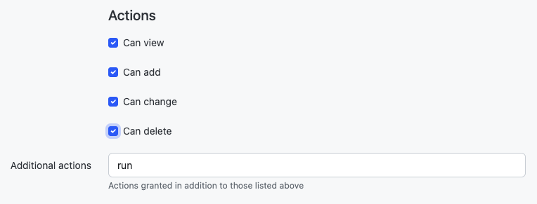

# NetBox报告

NetBox报告是验证NetBox中数据完整性的机制。运行报告允许用户验证在NetBox中定义的对象是否满足某些任意条件。例如，您可以编写报告来检查以下内容：

* 所有顶部交换机是否具有控制台连接
* 每个路由器是否具有具有分配IP地址的环回接口
* 每个接口描述是否符合标准格式
* 每个站点是否定义了一组最小VLAN
* 所有IP地址是否具有父前缀

......等等。报告是完全可定制的，因此您几乎可以测试任何内容。

## 编写报告

报告必须保存为文件，位于 [`REPORTS_ROOT`](../configuration/system.md#reports_root) 路径中（默认为 `netbox/reports/`）。在此路径中创建的每个文件都被视为单独的模块。每个模块包含一个或多个报告（Python类），每个报告执行特定的功能。每个报告的逻辑被分解成离散的测试方法，每个方法应用于构成整个测试的一部分。

!!! warning
    报告路径包括一个名为 `__init__.py` 的文件，该文件将该路径注册为Python模块。不要删除此文件。

例如，我们可以创建一个名为 `devices.py` 的模块，用于保存与NetBox中的设备相关的所有报告。在该模块中，我们可以定义多个报告。每个报告都定义为继承自 `extras.reports.Report` 的Python类。

```
from extras.reports import Report

class DeviceConnectionsReport(Report):
    description = "验证每个设备的最低物理连接"

class DeviceIPsReport(Report):
    description = "检查每个设备是否分配了主要IP地址"
```

在每个报告类中，我们将创建多个测试方法来执行报告的逻辑。例如，在DeviceConnectionsReport中，我们希望确保每个活动设备都具有控制台连接、带外管理连接和两个电源连接。

```
from dcim.choices import DeviceStatusChoices
from dcim.models import ConsolePort, Device, PowerPort
from extras.reports import Report


class DeviceConnectionsReport(Report):
    description = "验证每个设备的最低物理连接"

    def test_console_connection(self):

        # 检查每个活动设备的每个控制台端口是否定义了连接。
        active = DeviceStatusChoices.STATUS_ACTIVE
        for console_port in ConsolePort.objects.prefetch_related('device').filter(device__status=active):
            if not console_port.connected_endpoints:
                self.log_failure(
                    console_port.device,
                    "未为{}定义控制台连接".format(console_port.name)
                )
            elif not console_port.connection_status:
                self.log_warning(
                    console_port.device,
                    "{}的控制台连接标记为已计划".format(console_port.name)
                )
            else:
                self.log_success(console_port.device)

    def test_power_connections(self):

        # 检查每个活动设备是否至少有两个已连接的电源供应。
        for device in Device.objects.filter(status=DeviceStatusChoices.STATUS_ACTIVE):
            connected_ports = 0
            for power_port in PowerPort.objects.filter(device=device):
                if power_port.connected_endpoints:
                    connected_ports += 1
                    if not power_port.path.is_active:
                        self.log_warning(
                            device,
                            "{}的电源连接标记为已计划".format(power_port.name)
                        )
            if connected_ports < 2:
                self.log_failure(
                    device,
                    "找到{}个已连接的电源供应（需要2个）".format(connected_ports)
                )
            else:
                self.log_success(device)
```

正如您所看到的，报告是完全可定制的。验证逻辑可以简单或复杂，视情况而定。还请注意，`description` 属性支持Markdown语法，它将在报告列表页中呈现。

!!! warning
    报告永远不应更改数据：如果发现自己在报告中使用 `create()`、`save()`、`update()` 或 `delete()` 方法来更改对象，请停止并重新评估您想要实现的目标。请注意，没有防止意外更改或销毁数据的保护措施。

## 报告属性

### `description`

报告功能的人类友好描述。

### `scheduling_enabled`

默认情况下，报告可以计划在以后执行。将 `scheduling_enabled` 设置为 False 将禁用此功能：只能进行立即执行。 （这还将禁用设置定期执行间隔的能力。）

### `job_timeout`

设置报告的最大允许运行时间。如果未设置，将使用 `RQ_DEFAULT_TIMEOUT`。

## 记录

以下方法可用于在报告中记录结果：

* log(message)
* log_success(object, message=None)
* log_info(object, message)
* log_warning(object, message)
* log_failure(object, message)

记录一个或多个失败消息将自动将报告标记为失败。建议为每个要评估的对象记录一个成功，以便结果反映正在报告的对象数量。（成功时包含日志消息是可选的。）使用 `log()` 记录的消息将显示在报告的结果中，但不与特定对象或状态相关联。日志消息还支持使用Markdown语法，并将呈现在报告结果页上。

要在报告运行之前或之后执行其他任务（例如发送电子邮件或调用Webhook），请扩展 `pre_run()` 和/或 `post_run()` 方法。

默认情况下，模块内的报告在报告列表页中按字母顺序排列。要以特定顺序返回报告，可以在模块的末尾定义 `report_order` 变量。`report_order` 变量是一个包含每个报告类的元组，按所需的顺序排列。从此列表中省略的任何报告将在最后列出。

```python
from extras.reports import Report

class DeviceConnectionsReport(Report):
    pass

class DeviceIPsReport(Report):
    pass

report_order = (DeviceIPsReport, DeviceConnectionsReport)
```

创建报告后，它将出现在报告列表中。最初，报告不会关联任何结果。要生成结果，请运行报告。

## 运行报告

!!! note
    要运行报告，用户必须被分配`Extras > Report`、`Extras > Report Module`和`Core > Managed File`对象的权限。还必须分配`extras.run_report`权限。这可以通过在报告对象上分配用户（或组）权限，并在"权限"中指定"运行"操作来实现，如下所示。



### 通过Web界面

可以通过导航到报告并单击右上角的 "运行报告" 按钮来在Web界面上运行报告。运行报告后，其相关的结果将包含在报告视图中。可以计划在将来的指定时间执行报告。可以通过删除相关的作业结果对象来取消计划报告。

### 通过API

要通过API运行报告，只需向其 `运行` 端点发送POST请求。报告由其模块和类名标识。

```
    POST /api/extras/reports/<module>.<name>/run/
```

我们上面的示例报告将被调用为：

```
    POST /api/extras/reports/devices.DeviceConnectionsReport/run/
```

还可以在表单数据中可选地传递 `schedule_at`，其中包含日期时间字符串，以在指定的日期和时间安排脚本。

### 通过CLI

可以通过调用管理命令来在CLI上运行报告：

```
python3 manage.py runreport <module>
```

其中 `<module>` 是 `reports` 目录中的python文件的名称，不包含 `.py` 扩展名。可以指定一个或多个报告模块。