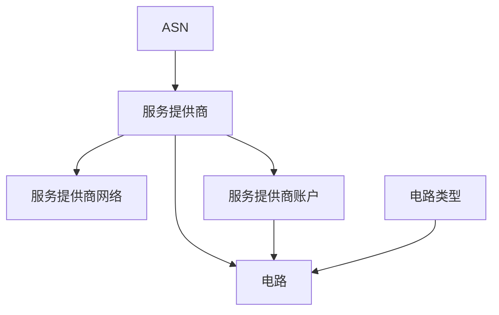

# 电路

NetBox 非常适合管理您网络的传输和对等互连提供商以及电路。它提供了建模数据中心和企业环境中物理电路所需的所有灵活性，并允许通过电缆直接将电路“连接”到设备接口。

## 提供商

提供商是提供互联网或私有连接的任何组织。通常，这些是大型运营商，但也可能包括区域提供商甚至内部服务。每个提供商都可以分配账户和联系详情，并且可能被分配一个或多个 AS 号码。

有时您需要对您没有完全可见性的提供商网络进行建模；这些通常在拓扑图上用云图标表示。NetBox 通过其提供商网络模型支持这一点：提供商网络代表了一个“黑盒”网络，您的电路可以连接到这个网络。一个常见的例子是连接多个站点的提供商 MPLS 网络。

## 电路

电路是由外部提供商安装和维护的两点间的物理连接。例如，以光纤电缆形式提供的互联网连接将在 NetBox 中被建模为一个电路。

每个电路都与一个提供商相关联，并被分配一个电路 ID，该 ID 必须对该提供商是唯一的。电路还被分配一个用户定义的类型、运行状态和各种其他运行特性。提供商账户也可以用来进一步分类属于共同提供商的电路：这些可能代表不同的业务单位或技术。

每个电路最多可以定义两个终端（A 和 Z）。每个终端可以与特定站点或提供商网络相关联。在前者的情况下，可以在电路终端和设备组件之间连接电缆，以映射其物理连接性。

!!! 警告 "物理电路 vs. 虚拟电路"
    NetBox 中的电路模型代表**物理**连接。不要将这些与提供商在物理基础设施上提供的_虚拟_电路混淆。（例如，带 VLAN 标记的子接口将是一个虚拟电路。）一个好的经验法则：如果您无法指出它，它就不是一个物理电路。