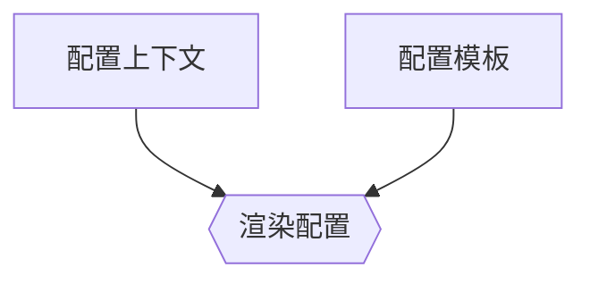

# 配置渲染

操作网络的一个关键方面是确保每个网络节点都被正确配置。通过利用配置模板和[上下文数据](./context-data.md)，NetBox 可以为网络上的每个设备渲染完整的配置文件。



## 配置模板

配置模板使用 [Jinja2 模板语言](https://jinja.palletsprojects.com/)编写，并且可以从远程数据源自动填充。在渲染过程中，上下文数据被应用到模板中，以输出完整的配置文件。下面是一个使用 Jinja2 模板渲染简单网络交换机配置文件的示例。

```jinja2



    system {
        host-name {{ device.name }};
        domain-name example.com;
        time-zone UTC;
        authentication-order [ password radius ];
        ntp {
            
                server {{ server }};
            
        }
    }
    
        
    

```

当为特定 NetBox 设备渲染时，模板的 `device` 变量将被填充设备实例，而 `ntp_servers` 将从设备的可用上下文数据中提取。生成的输出将是一个有效的配置段，可以直接应用于兼容的网络设备。

### 上下文数据

用于渲染配置的对象作为模板上下文中的 `设备` 或 `虚拟机` 分别对于设备和虚拟机可用。此外，NetBox模型类可以被所属的应用程序或插件访问。例如：

```
共有 {{ dcim.Site.objects.count() }} 个站点。
```

## 渲染模板

### 设备配置

NetBox 提供了一个专门用于渲染特定设备默认配置模板的 REST API 端点。这是通过向设备的唯一 URL 发送 POST 请求来实现的，可选地包括额外的上下文数据。

```no-highlight
curl -X POST \
-H "Authorization: Token $TOKEN" \
-H "Content-Type: application/json" \
-H "Accept: application/json; indent=4" \
http://netbox:8000/api/dcim/devices/123/render-config/ \
--data '{
  "extra_data": "abc123"
}'
```

此请求将按以下顺序触发设备首选的配置模板的解析：

* 分配给单个设备的配置模板
* 分配给设备角色的配置模板
* 分配给设备平台的配置模板

如果这三个对象中没有分配配置模板，则请求将失败。

可以通过设置 `Accept:` HTTP 标头来将配置呈现为JSON或纯文本。例如：

* `Accept: application/json`
* `Accept: text/plain`

### 通用用途

NetBox配置模板也可以在不与任何特定设备绑定的情况下呈现，使用单独的通用用途REST API端点。通过POST请求发送到此端点的任何数据都将作为模板的上下文数据传递。

```no-highlight
curl -X POST \
-H "Authorization: Token $TOKEN" \
-H "Content-Type: application/json" \
-H "Accept: application/json; indent=4" \
http://netbox:8000/api/extras/config-templates/123/render/ \
--data '{
  "foo": "abc",
  "bar": 123
}'
```