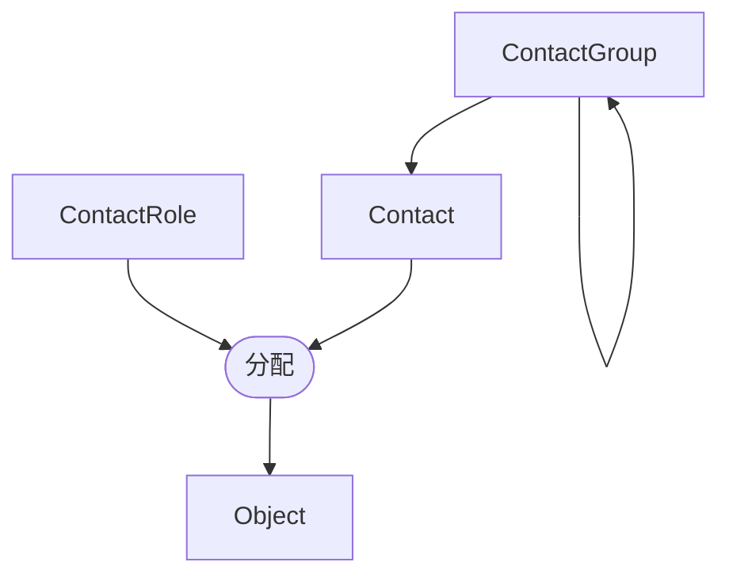

# 联系人

就像[租户](./tenancy.md)一样，联系人分配使您能够跟踪在 NetBox 中建模的资源的所有权。联系人代表在其分配角色的上下文中负责资源的个人。

## 联系人组

联系人可以任意分组到递归层次结构中，且联系人可以在层次结构的任何级别被分配到一个组。

## 联系人角色

联系人角色定义了联系人与分配对象的关系。例如，您可能会定义行政、运营和紧急联系人的角色。

## 联系人

联系人应代表一个个人或永久联系点。每个联系人必须定义一个名称，并且可以选择性地包括职称、电话号码、电子邮件地址和相关细节。

联系人用于分配时会被重用，因此每个独特的联系人只需创建一次，并且可以分配给任何数量的 NetBox 对象，而且对象可以拥有的分配联系人数量没有限制。NetBox 中的大多数核心对象都可以分配联系人。

以下模型支持分配联系人：

* circuits.Circuit
* circuits.Provider
* circuits.ProviderAccount
* dcim.Device
* dcim.Location
* dcim.Manufacturer
* dcim.PowerPanel
* dcim.Rack
* dcim.Region
* dcim.Site
* dcim.SiteGroup
* tenancy.Tenant
* virtualization.Cluster
* virtualization.ClusterGroup
* virtualization.VirtualMachine