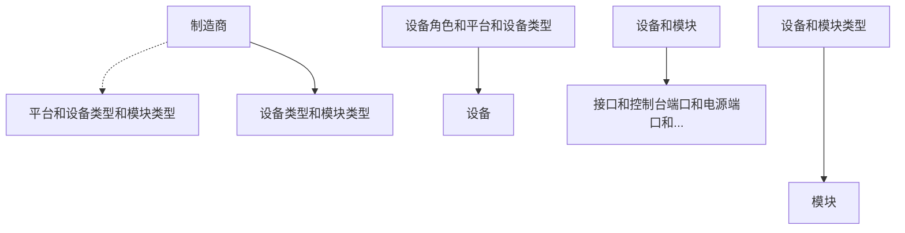
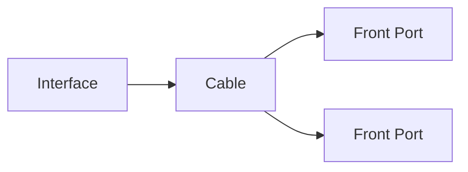

# 设备和布线

NetBox 的核心是作为建模您的网络基础设施的工具，而设备对象对于这一功能至关重要。设备可以是安装在您网络中的任何物理硬件，如服务器、路由器或交换机，并且可以选择性地安装在机架中。在每个设备内部，诸如网络接口和控制台端口之类的资源作为独立组件进行建模，这些组件可以选择性地分组到模块中。

NetBox 使用设备类型来代表独特的真实世界设备模型。这允许用户定义一个设备类型及其所有组件一次，并且可以轻松地从中复制无限数量的设备实例。

## 制造商

制造商通常代表生产硬件设备的组织。这些可以由用户定义，但它们应该代表一个实际实体，而不是某种抽象概念。

## 设备类型

设备类型代表制造商和硬件模型的独特组合，对应于现实世界中存在的具体制造和型号的设备。每个设备类型通常在其上创建许多组件，代表网络接口、设备舱等。然后可以在 NetBox 中创建此类型的新设备，并且任何相关组件都将自动从设备类型复制。这避免了在 NetBox 中添加每个设备时繁琐地重新创建组件。

!!! 提示 "设备类型库"
    尽管用户始终可以在 NetBox 中自行创建自己的设备类型，但许多人发现从我们的[社区库](https://github.com/netbox-community/devicetype-library)中获取预定义设备类型很方便。这是可能的，因为特定制造和型号的设备普遍适用且永不改变。

所有以下内容都可以作为组件进行建模：

* 接口
* 控制台端口
* 控制台服务器端口
* 电源端口
* 电源插座
* 直通端口（前端和后端）
* 模块舱（容纳模块）
* 设备舱（容纳子设备）

例如，Juniper EX4300-48T 设备类型可能定义了以下组件模板：

* 一个控制台端口模板（"Console"）
* 两个电源端口模板（"PSU0" 和 "PSU1"）
* 48个 1GE 接口模板（"ge-0/0/0" 至 "ge-0/0/47"）
* 四个 10GE 接口模板（"xe-0/2/0" 至 "xe-0/2/3"）

一旦创建了组件模板，您创建的每个作为此类型实例的新设备将自动分配上述每个组件。

!!! 注意 "组件实例化不是追溯的"
    组件从设备类型定义中实例化仅在设备创建时发生。如果您修改了分配给设备类型的组件，它不会影响已经创建的设备。这防止了对现有设备的任何意外更改。但是，您始终可以在现有设备上添加、修改或删除组件。（这些更改可以使用 UI 中提供的批量操作轻松地同时应用于多个设备。）

## 设备

设备类型定义了设备的制造和型号，而设备本身代表现实世界中安装的实际硬件。设备可以安装在设备机架的特定位置上，或仅与站点相关联（并且可以选择性地与该站点内的位置相关联）。

每个设备可以分配操作状态、功能角色和软件平台。设备组件在创建时会从分配的设备类型中自动实例化。

### 虚拟机箱

有时需要将一组物理设备建模为共享单一管理平面。堆叠式交换机是这种情况的最常见示例。这些可以在 NetBox 中建模为虚拟机箱，其中一个设备充当机箱主机，其余为成员。成员设备的所有组件将出现在主机上。

### 虚拟设备上下文

虚拟设备上下文（VDC）是设备内的逻辑分区。每个 VDC 独立运行，但共享公共资源池。每个接口可以分配给其设备上的一个或多个 VDC。

## 模块类型和模块

与设备类型和设备类似，模块类型可以实例化单独的模块，这些模块是安装在设备内的硬件组件。模块通常有自己的子组件，这些子组件可供父设备使用。例如，在 NetBox 中建模带有多个线卡的机箱式交换机时，机箱将从设备类型创建为设备，其上的每个线卡将从模块类型实例化为安装在设备模块舱内的模块。

!!! 提示 "设备舱 vs. 模块舱"
    设备舱和模块舱有什么区别？当安装的硬件拥有与父设备隔离的自己的管理平面时，设备舱是适当的。一个常见的例子是刀片服务器机箱，其中刀片共享电源但独立运行。相反，模块舱容纳的模块并不独立于其父设备运行，就像上述机箱交换机线卡的例子。

模块的一个特别好的特性是，可以根据父模块安装的模块舱自动重命名模板化组件。例如，如果我们创建一个接口命名为 `Gi{module}/0/1-48` 的模块类型，并将此类型的模块安装在设备的模块舱 7 中，NetBox 将创建名为 `Gi7/0/1-48` 的接口。

## 电缆

NetBox 将电缆建模为设备组件和其他对象之间的连接。每根电缆可以分配类型、颜色、长度和标签。NetBox 将执行基本的合理性检查以防止无效连接。（例如，网络接口无法连接到电源插座。）

电缆的任一端都可以终止到同一类型的多个对象。例如，网络接口可以通过光纤电缆连接到补丁面板上的两个独立端口（每个端口连接到补丁电缆中的单个光纤）。

