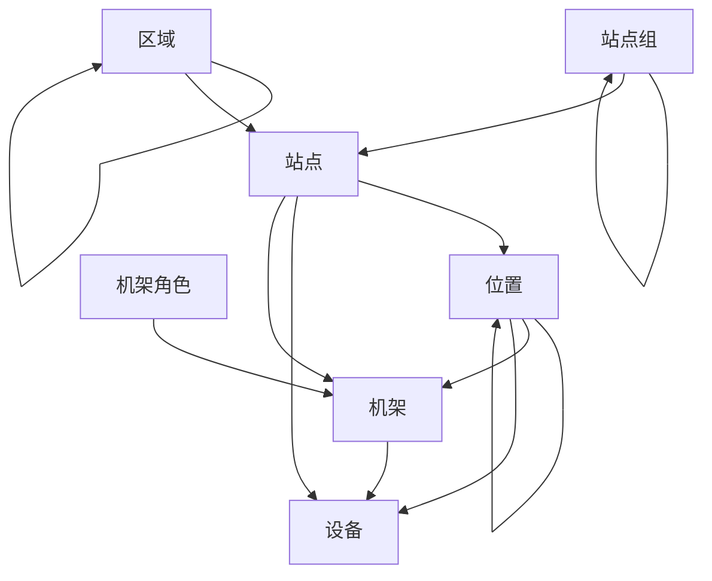

# 设施

从全球地区到单个设备机架，NetBox允许您对网络的整个存在进行建模。这是通过使用几个专门构建的模型来实现的。下面的图表说明了这些模型及其关系。

## 区域

区域代表您的网络或其客户存在的地理域。通常用于建模国家、州和城市，尽管NetBox不规定任何精确的用途，您的需求可能不同。

区域是自我嵌套的，因此您可以在父级内定义子区域，并在每个子区域内定义孙子区域。例如，您可以创建这样的层次结构：

* 欧洲
    * 法国
    * 德国
    * 西班牙
* 北美
    * 加拿大
    * 美国
        * 加利福尼亚
        * 纽约
        * 德克萨斯

区域始终按名称在每个父级内按字母顺序列出，并且层次结构的深度没有最大限制。

## 站点组

与区域一样，站点组可以按递归层次结构排列以对站点进行分组。然而，虽然区域用于地理组织，但站点组也可以用于功能分组。例如，除了站点的物理位置，您还可以将站点分类为公司、分支机构或客户站点。

同时使用区域和站点组可以在站点可以组织的独立但互补的维度上提供便利。

## 站点

站点通常代表区域和/或站点组内的建筑物。每个站点都被分配了操作状态（例如，活动或计划中），并且可以分配离散的邮寄地址和GPS坐标。

## 位置

位置可以是建筑物内的任何逻辑细分，例如楼层或房间。与区域和站点组一样，位置可以嵌套到自我递归的层次结构中，以实现最大的灵活性。与站点一样，每个位置都有分配给它的操作状态。

## 机架

最后，NetBox将每个设备机架建模为站点和位置内的离散对象。这些是设备安装的物理对象。每个机架可以分配操作状态、类型、设备ID和与库存跟踪相关的其他属性。每个机架还必须定义高度（以机架单元为单位）和宽度，并且可以选择指定其物理尺寸。

每个机架必须与一个站点关联，但不是必须将其分配给该站点内的位置。用户还可以创建可分配给机架的自定义角色。NetBox支持以半单元增量跟踪机架空间，因此可以在机架内的位置2.5上安装设备，等等。

!!! 提示 "设备"
    您会注意到上面的图表中，设备可以安装在站点、位置或机架内。这种方法提供了足够的灵活性，因为不是所有站点都需要定义子位置，而不是所有设备都驻留在机架内。