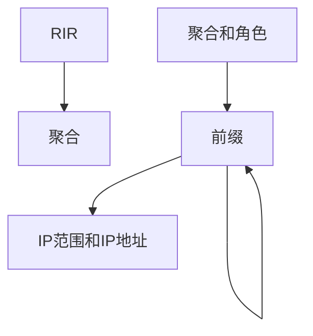

# IP地址管理

IP地址管理（IPAM）是NetBox的核心功能之一。它支持IPv4和IPv6的完全对等、高级VRF分配、自动层次结构形成等等。

## IP层次结构

NetBox使用多个对象类型来表示IP资源的层次结构：

* **聚合** - 表示寻址层次结构根的前缀。通常是为您的组织分配的大量公共或私有地址空间。每个聚合都分配给一个权威的RIR。
* **前缀** - 在聚合内定义的子网。前缀通过相互嵌套来扩展层次结构。（例如，192.168.123.0/24将出现在192.168.0.0/16内。）每个前缀可以分配功能角色和操作状态。
* **IP范围** - 前缀内一组任意的具体IP地址，它们共享相同的子网掩码。范围通常与DHCP范围相关联，但也可用于任何类似的用途。
* **IP地址** - 单个IP地址以及其子网掩码，自动排列在其父前缀下。

!!! tip "自动层次结构"
    在NetBox中，IP对象永远不需要手动分配给父对象。层次结构的构建由应用程序根据IP寻址的固有规则自动处理。

一个示例层次结构可能如下所示：

* 100.64.0.0/10（聚合）
    * 100.64.0.0/20（前缀）
    * 100.64.16.0/20（前缀）
        * 100.64.16.0/24（前缀）
            * 100.64.16.1/24（地址）
            * 100.64.16.2/24（地址）
            * 100.64.16.3/24（地址）
        * 100.64.19.0/24（前缀）
    * 100.64.32.0/20（前缀）
        * 100.64.32.1/24（地址）
        * 100.64.32.10-99/24（范围）

## 利用率统计

每个前缀的利用率根据其状态自动计算。_容器_前缀是包含子前缀的前缀；它们的利用率根据子前缀占用的可用IP空间来确定。对于任何其他类型的前缀，其利用率是根据定义的任何子IP地址和/或范围的聚合使用情况来确定的。

同样，聚合的利用率是根据其子前缀占用的空间来确定的。

## VRF跟踪

NetBox支持建模离散虚拟路由和转发（VRF）实例，以表示多个路由表，包括具有重叠地址空间的路由表。聚合内的每种IP对象 - 前缀、IP范围和IP地址 - 都可以分配给特定的VRF。因此，每个VRF都维护其自己隔离的IP层次结构。这使得跟踪重叠的IP空间非常容易。

NetBox中的VRF建模非常接近现实世界的网络配置，每个VRF分配一个符合标准的路由区分器。您甚至可以创建路由目标，以管理VRF之间的路由信息的导入和导出。

!!! tip "强制唯一IP空间"
    每个VRF可以独立配置以允许或禁止重复的IP对象。例如，已配置为强制执行唯一IP空间的VRF不会允许创建两个192.0.2.0/24前缀。每个VRF可以切换此约束，为用户在建模其IP空间时提供最大的灵活性。

## 自治系统（AS）编号

作为IPAM经常被忽视的组成部分，NetBox还跟踪自治系统（AS）编号及其分配给站点。支持16位和32位AS编号，与聚合一样，每个ASN都分配给一个权威的RIR。

## 服务映射

NetBox将网络应用程序建模为与设备和/或虚拟机关联的离散服务对象，并可选择将特定IP地址附加到这些父对象。这些可以用于编录运行在您的网络上的应用程序，供其他对象或集成工具参考。

要在NetBox中建模服务，首先创建一个服务模板，定义服务监听的名称、协议和端口号。然后可以轻松地将此模板实例化以将新服务“附加”到设备或虚拟机。也可以手动创建新服务，而无需模板，不过这种方法可能会很繁琐。