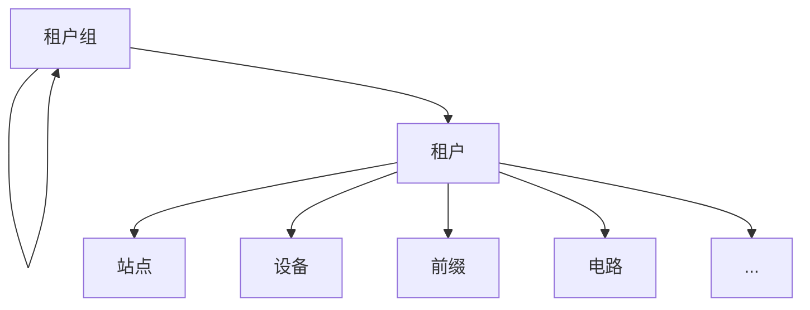

# 租户

NetBox数据模型中的大多数核心对象都支持租赁（tenancy）。这是将对象与特定租户关联，以传达所有权或依赖关系的方式。例如，一个企业可以将其内部业务单元表示为租户，而托管服务提供商可以在NetBox中创建一个租户来代表其每个客户。

## 租户组

租户可以根据您的用例需求按任何逻辑进行分组，并且可以递归嵌套组以获得最大的灵活性。例如，您可以在其中定义一个父级“客户”组，下面有“当前”和“过去”两个子组。租户可以分配到层次结构中的任何级别。

## 租户

通常，租户模型用于表示客户或内部组织，但它可以用于满足您需求的任何目的。

NetBox中的大多数核心对象都可以分配给特定的租户，因此此模型提供了一种非常方便的方式来在对象类型之间相关所有权。例如，您的每个客户可能都有自己的机架、设备、IP地址、电路等：通过租户分配，可以轻松跟踪所有这些。

以下对象可以分配给租户：

* 站点
* 机架
* 机架预订
* 设备
* VRF
* 前缀
* IP地址
* VLANs
* 电路
* 集群
* 虚拟机

租户分配用于表示NetBox中对象的所有权。因此，每个对象只能由一个租户拥有。例如，如果有一个专门为某个客户的防火墙，您会将其分配给代表该客户的租户。但是，如果防火墙为多个客户提供服务，它就不属于任何特定的客户，因此不适合租户分配。