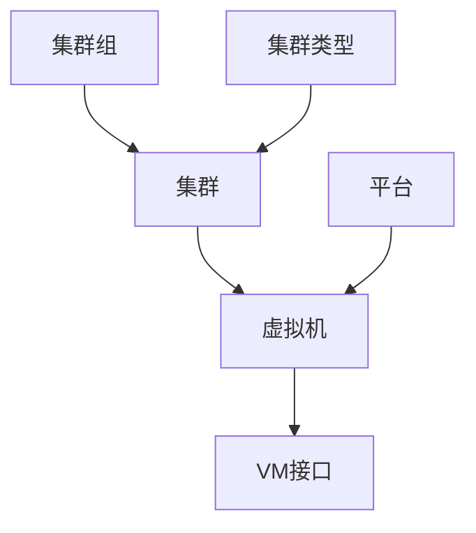

# 虚拟化

虚拟机和集群可以在NetBox中与物理基础设施一起建模。IP地址和其他资源被分配给这些对象，就像分配给物理对象一样，为物理和虚拟网络之间提供了无缝集成。

## 集群

集群是一个或多个物理主机设备，可以在上面运行虚拟机。每个集群必须具有类型和运行状态，并可以分配到一个组。 （类型和组都是用户定义的。）每个集群可以指定一个或多个设备作为主机，但这是可选的。

## 虚拟机

虚拟机是一个虚拟化的计算实例。在NetBox中，它们的行为与设备对象非常相似，但没有任何物理属性。例如，虚拟机可以分配给它的接口具有IP地址和VLAN，但它的接口不能通过电缆连接（因为它们是虚拟的）。每个虚拟机还可以定义其计算、内存和存储资源等。