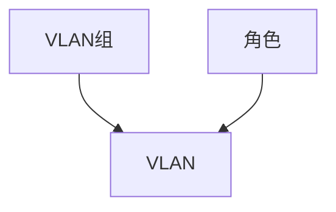

# VLAN管理

除了IPAM功能，NetBox还跟踪VLAN信息，以帮助进行二层网络配置。VLAN是按照IEEE 802.1Q及相关标准定义的，可以分配到组和功能角色。

## VLAN组

VLAN组是在特定范围内定义的一组VLAN。每个VLAN组可以与特定的站点、位置、机架或类似的对象关联，以指示其域，并指定组内的最小和最大VLAN ID（默认情况下，这些值分别是标准的1和4094）。

在组内，每个VLAN必须具有唯一的ID和名称。可以创建多个组，没有限制。

## VLAN

NetBox根据IEEE 802.1Q标准的定义对VLAN进行建模，具有12位VLAN ID和名称。每个VLAN还具有操作状态，并且可以分配功能角色，就像前缀一样。每个VLAN可以分配给一个VLAN组或站点，以传达VLAN存在的域。

一旦定义了VLAN，就可以将其与设备和虚拟机接口关联起来。每个接口可以分配802.1Q模式（访问或标记），并且可以将相关的VLAN分配为标记或未标记。