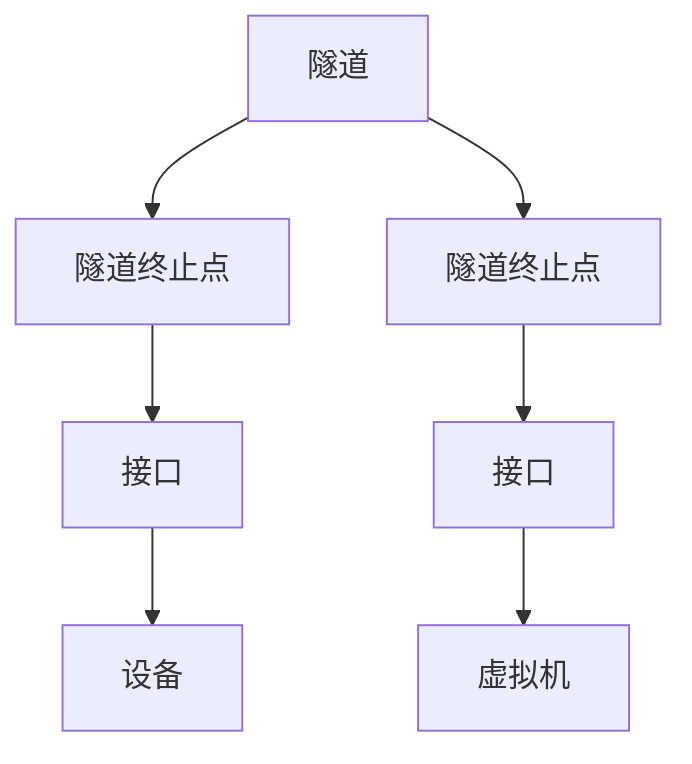
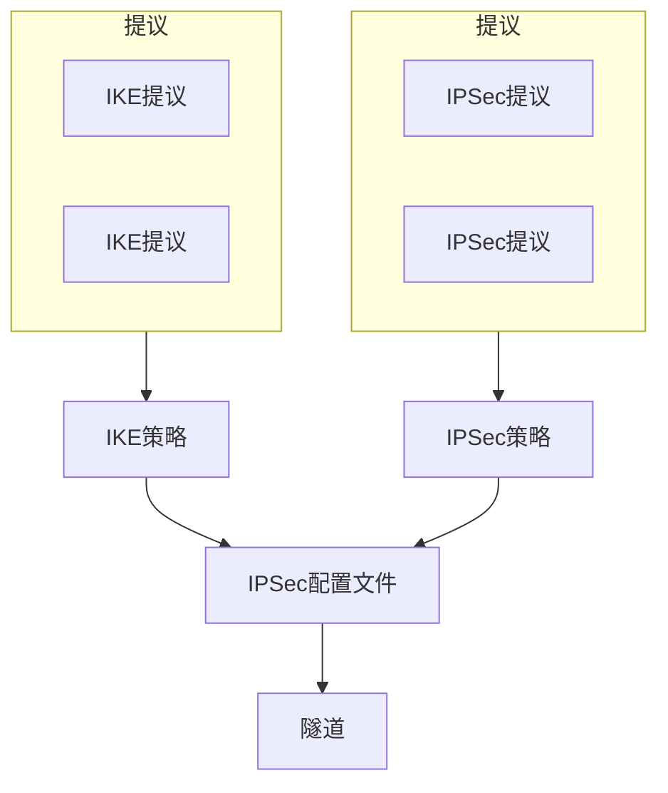

# 隧道

NetBox可以对网络中虚拟终结点之间形成的私有隧道进行建模。典型的隧道实现包括GRE、IP-in-IP和IPSec。一个隧道可以终止到两个或多个设备或虚拟机接口。为了方便组织，隧道可以分配给用户定义的组。

```mermaid
flowchart TD
    Termination1[隧道终止点]
    Termination2[隧道终止点]
    Interface1[接口]
    Interface2[接口]
    隧道 --> Termination1 & Termination2
    Termination1 --> Interface1
    Termination2 --> Interface2
    Interface1 --> 设备
    Interface2 --> 虚拟机

click 隧道 "../../models/vpn/tunnel/"
click 隧道终止点1 "../../models/vpn/tunneltermination/"
click 隧道终止点2 "../../models/vpn/tunneltermination/"
```

# IPSec与IKE

NetBox包含对建模IPSec与IKE策略的强大支持。这些策略用于定义IPSec隧道的加密和认证参数。

```mermaid
flowchart TD
    subgraph IKEProposals[提议]
    IKEProposal1[IKE提议]
    IKEProposal2[IKE提议]
    end
    subgraph IPSecProposals[提议]
    IPSecProposal1[IPSec提议]
    IPSecProposal2[IPSec提议]
    end
    IKEProposals --> IKE策略
    IPSecProposals --> IPSec策略
    IKE策略 & IPSec策略--> IPSec配置文件
    IPSec配置文件 --> 隧道

click IKE提议1 "../../models/vpn/ikeproposal/"
click IKE提议2 "../../models/vpn/ikeproposal/"
click IKE策略 "../../models/vpn/ikepolicy/"
click IPSec提议1 "../../models/vpn/ipsecproposal/"
click IPSec提议2 "../../models/vpn/ipsecproposal/"
click IPSec策略 "../../models/vpn/ipsecpolicy/"
click IPSec配置文件 "../../models/vpn/ipsecprofile/"
click 隧道 "../../models/vpn/tunnel/"
```