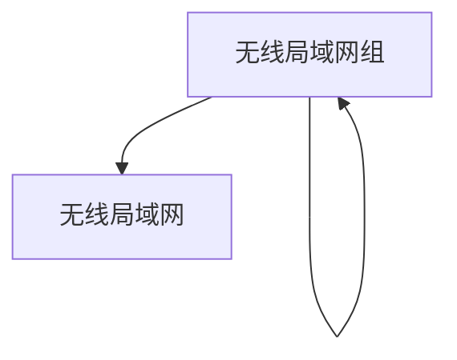

# 无线网络

与NetBox为物理电缆系统提供强大建模支持一样，它也支持对无线局域网和点对点链接进行建模。

## 无线局域网

无线局域网是由多个无线客户端共享的多接入网络，通过共同的服务集标识符（SSID）和认证参数进行识别。无线局域网可以组织成自嵌套组，并且每个无线局域网可以选择性地绑定到特定的虚拟局域网（VLAN）。这使得无线网络可以轻松地映射到它们有线对应物。

无线局域网的认证属性包括：

* **类型** - 开放、WEP、WPA等。
* **加密方式** - 自动、TKIP或AES。
* **预共享密钥（PSK）** - 配置在所有参与客户端上的秘密密钥。

认证参数的定义是可选的。

## 无线链接

与无线局域网代表具有任意数量客户端的物理多接入段不同，无线链接是精确连接两个站点的点对点连接。这些链接的行为类似于电缆，但更准确地建模了无线通信的性质。

与无线局域网一样，无线链接也具有SSID和（可选的）认证属性。