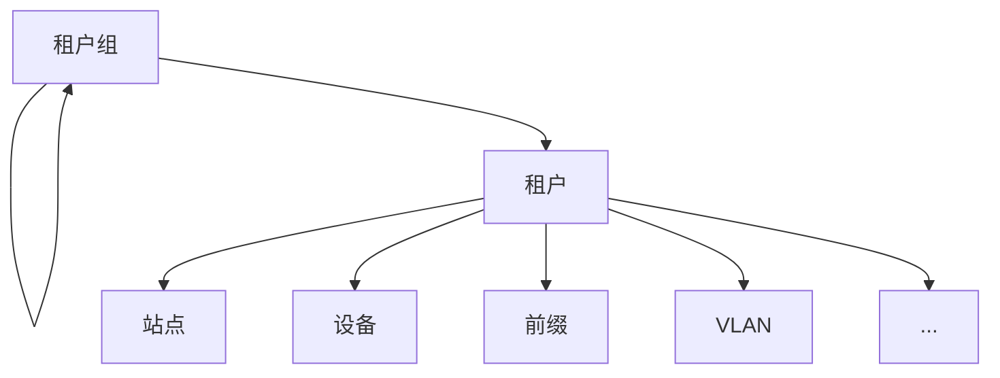
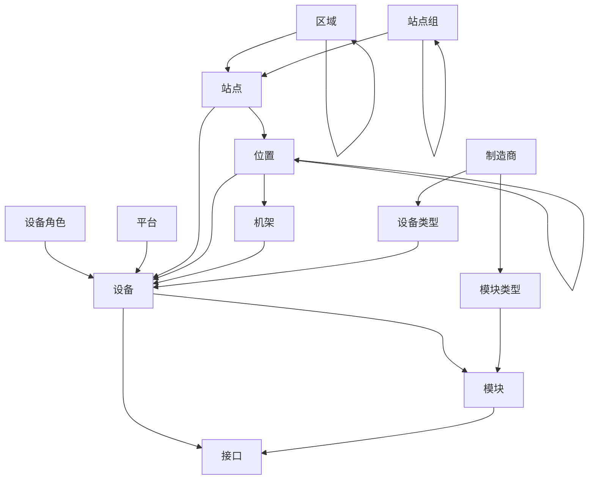
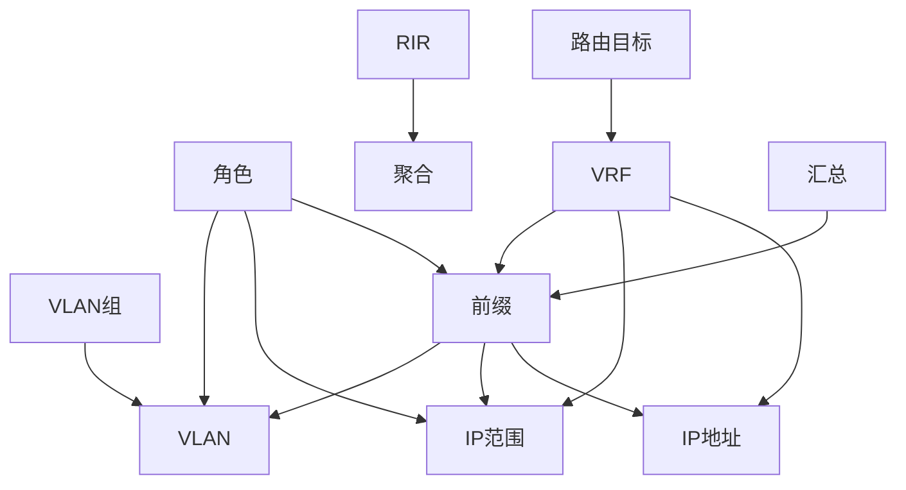
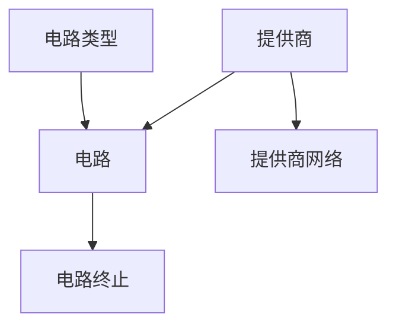
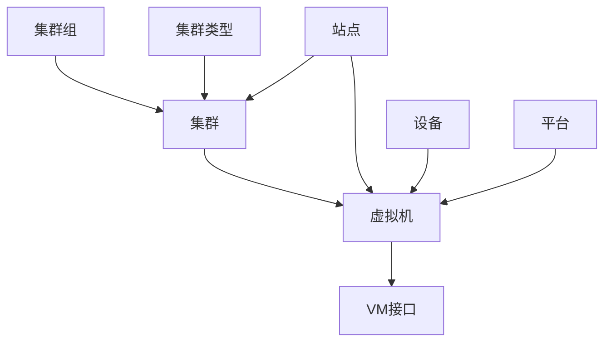

# 计划您的迁移

本指南概述了计划成功迁移到NetBox所需的步骤。虽然它是在全新安装的背景下编写的，但在现有NetBox部署中添加新数据时，这里概述的一般方法同样适用。

## 确定当前的真实来源

在开始使用NetBox管理自己的数据之前，首先要了解您当前的真实来源。 "真实来源" 实际上只是指某个数据的仓库，它在给定领域中具有权威性。例如，您可能有一个跟踪网络上所有IP前缀使用情况的电子表格。只要涉及的每个人都同意这个电子表格是整个网络的_权威_数据，它就是您的IP前缀的真实来源。

任何东西都可以是真实来源，只要满足以下两个条件：

1. 所有相关方都同意此数据源是正确的。
2. 适用于该数据源的领域已明确定义。

<!-- TODO: Example SoT -->

花些时间来清点您的基础设施的真实来源。在尝试对其进行编目时，您很可能会遇到一些挑战，例如：

* 为给定领域存在多个冲突的来源。例如，可能有多个版本的电子表格在流通，每个版本都声称有一组冲突的数据。
* 没有定义领域的数据源。您可能会发现组织内的不同团队使用不同的工具执行相同的任务，而没有正常的定义何时应该使用其中之一。
* 不可访问的数据格式。有些工具比其他工具更适合进行编程使用。例如，电子表格通常非常容易解析和导出，但wiki或类似应用程序上的自由格式注释则更难消耗。
* 没有真实来源。有时，您会发现领域的真实来源根本不存在。例如，当分配IP地址时，操作员可能只是使用子网中的任何（假定的）可用IP，而不会记录其使用情况。

看看您是否可以识别组织的每个基础设施数据领域以及每个领域的真实来源。一旦编制了这些清单，您将需要确定哪些数据应该放入NetBox。

## 确定要迁移的内容

在确定要将哪些数据迁移到NetBox时，通常的规则是：如果有一个模型适用于它，那么它就应该放入NetBox。例如，NetBox专门为机架、设备、电缆、IP前缀、VLAN等提供了内置模型。这些非常容易使用。然而，您最终会达到NetBox数据模型的极限，并且会质疑是否有必要在NetBox中记录其他数据。例如，您可能会想知道NetBox是否应该作为基础设施DNS记录或DHCP范围的真实来源。

NetBox提供了两种扩展其数据模型的核心机制。第一个是自定义字段：NetBox中的大多数模型都支持添加自定义字段，以存储没有内置字段的附加数据。例如，您可能希望为设备模型添加一个“库存ID”字段。第二个机制是插件。用户可以创建自己的插件，以在NetBox中引入全新的模型、视图和API端点。这可以非常强大，因为它支持快速开发和与核心模型的紧密集成。

尽管如此，将数据领域迁移到NetBox并不总是有意义。例如，许多组织选择仅使用NetBox的IPAM组件或仅使用NetBox的DCIM组件，并与其他真实来源集成不同领域。这是一个完全有效的方法（只要涉及的每个人都同意哪个工具是每个领域的权威）。最终，您需要权衡将非本机数据模型放入NetBox与定义和维护这些模型所需的工作之间的价值。

还要考虑到NetBox正在不断发展。尽管当前版本可能不支持特定类型的对象，但可能会计划在将来的版本中添加对其的支持。 （如果没有，考虑提交一个引用您的用例的功能请求。）

## 验证现有数据

迁移数据到NetBox之前的最后一步是最关键的：**验证**。垃圾进垃圾出的原则完全适用：您的真实来源只有其包含的数据一样好。虽然NetBox具有非常强大的数据验证工具（包括对自定义验证规则的支持），但最终还是由人操作员来断定什么是正确的，什么是不正确的。例如，NetBox可以验证两个接口之间的电缆连接，但它无法说这根电缆是否应该在那里。

以下是一些有助于确保您仅将有效数据导入NetBox的提示：

* 确保您从完整、格式良好的数据开始。强烈建议使用JSON或CSV以获得最佳可移植性。
* 考虑在导入之前在NetBox中定义自定义验证规则。 （例如，强制执行设备命名方案。）
* 使用自定义脚本自动填充模式化数据。 （例如，自动为每个站点创建一组标准的VLAN。）

有几种方法可用于将数据导入NetBox，我们将在下一节中介绍这些方法。

## 操作顺序

当从一个完全空白的数据库开始时，可能不会立即清楚从哪里开始。NetBox中的许多模型依赖于其他类型的高级创建。例如，只有在创建了制造商之后，才能创建设备类型。

以下是应创建或导入NetBox对象的（粗略）建议顺序。虽然不需要按照这个确切的顺序进行操作，但这样做将有助于确保工作流程最顺畅。

1. 租户组和租户
2. 区域、站点组、站点和位置
3. 机架角色和机架
4. 制造商、设备类型和模块类型
5. 平台和设备角色
6. 设备和模块
7. 提供商、提供商帐户和提供商网络
8. 电路类型和电路
9. 无线局域网组和无线局域网
10. 路由目标和VRF
11. RIR和汇总
12. IP/VLAN角色
13. 前缀、IP范围和IP地址
14. VLAN组和VLAN
15. 集群类型、集群组和集群
16. 虚拟机和虚拟机接口

这不是一个详尽无遗的清单，但对于初始数据导入来说应该足够了。在这些之外，对象的添加顺序没有太大的影响。

下面的图表为您提供了NetBox不同模型之间的一些核心依赖关系的参考。

!!! 注意 "自我嵌套模型"
    在下面的图表中，每个模型都显示了一个指向自身的循环箭头，表示该模型可以嵌套在递归层次结构中。例如，您可以有代表国家和城市的区域，后者嵌套在前者之下。

### 租户

### 站点、机架和设备

### VRF、前缀、IP地址和VLAN

### 电路

### 集群和虚拟机

